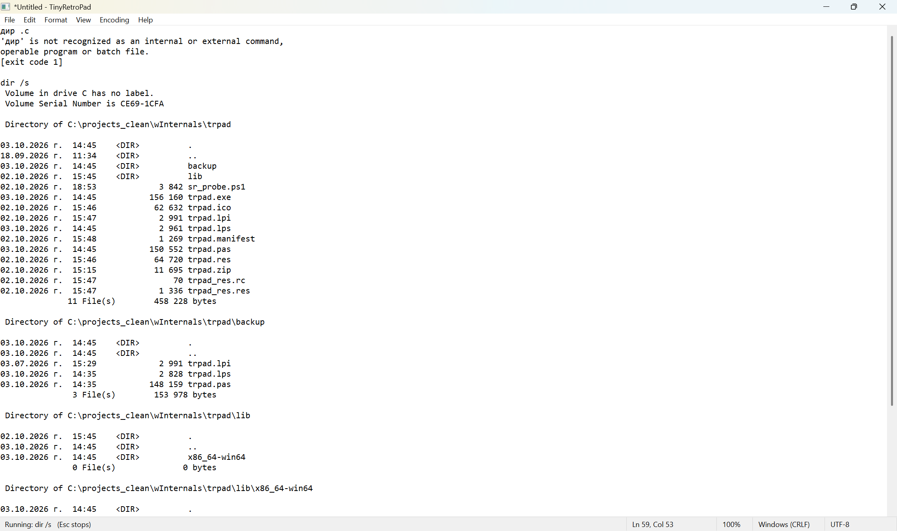
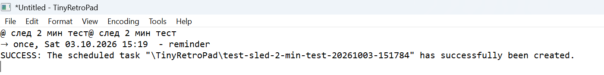
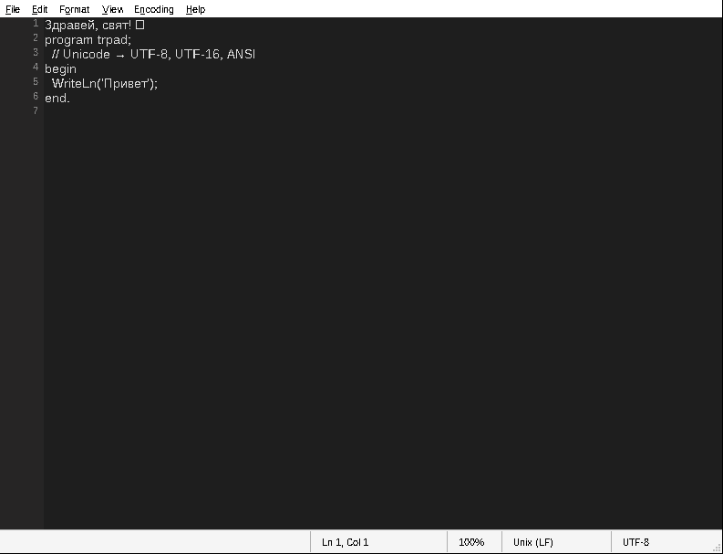
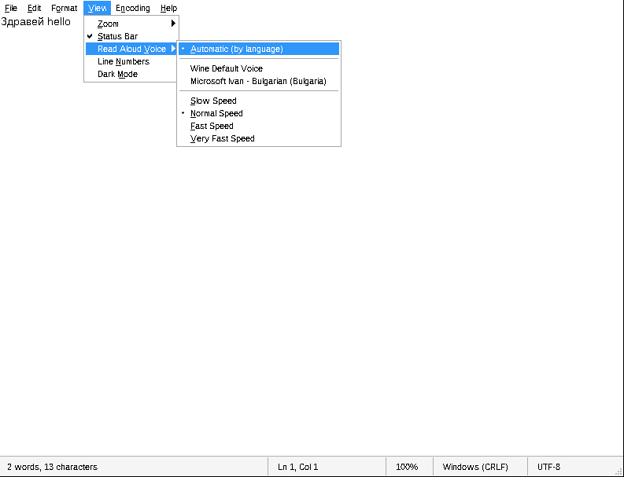

# TinyRetroPad

**A ~200 KB Notepad-style editor for Windows, written in Free Pascal on the pure Win32 API. No LCL, no VCL, no external units, no DLLs of its own.**

It began as a Pascal port of Dave Plummer's tiny assembly editor `trpad.asm`. Then it grew. Now it reads text aloud, runs lines as shell commands and scripts, pipes text through commands, schedules reminders in Windows Task Scheduler, adds up your lists, ticks off your tasks and keeps a history of every save. It still fits in a single source file.

**[⬇ Download trpad.exe (Releases)](https://github.com/vlevunliev/TinyRetroPad/releases/latest)** · Windows 10/11 x64, no installer, just run it.



> *Българска версия – [по-долу](#на-български).*

---

## Highlights

| | |
|---|---|
| **Ctrl+Enter runs the line** | Type `dir`, `ping 8.8.8.8 -t` or `git status` and press **Ctrl+Enter**. The output streams in **below the line, as editable text**. Press **Esc** to stop it. `cd` is remembered between commands. Exit codes are shown. |
| **Lines become scheduled tasks** | `@ tomorrow 09:00 backup.bat` or `@ in 20 min Take out the pizza` + **Ctrl+Enter** creates a real task in Windows Task Scheduler. It fires even when the editor is closed. Plain text becomes a reminder that pops up and is **read aloud**. |
| **Live sums** | Write `total =` (or `общо =`, `средно =`, `max =`…) under a list. It fills itself in from the numbers above and **updates as you type**. |
| **Task lists** | **Ctrl+Space** toggles `[ ]` ↔ `[x] ✓ 05.10 17:56`. Enter continues the list. **Ctrl+Enter** on `[ ] 18:30 Call Ivan` sets a reminder. |
| **Scripts and filters** | Select several lines + **Ctrl+Enter** runs them as one script (cmd, `#ps` PowerShell, `#py` Python). **Ctrl+Shift+Enter** pipes the selection through a command (`sort`, `findstr`, PowerShell) and replaces it with the output. |
| **History** | Every Save keeps a version. **File → History** brings any of them back with one click (and Ctrl+Z undoes that). |
| **Read aloud** | **Ctrl+R** uses SAPI. It also finds the modern OneCore voices installed from *Settings → Speech* (for example the Bulgarian voice), with no registry hacks. The spoken word is highlighted (karaoke style), and the reading position is remembered per file across restarts. |
| **Proper text handling** | Full Unicode. Auto-detects UTF-8 / UTF-8 BOM / UTF-16 LE/BE / ANSI and CRLF / LF / CR, and saves back in the same format. Warns before ANSI would lose characters. |
| **Small but useful** | Spell checking (Windows 8+), word count, zoom, dark mode, line numbers, auto-indent, sort / dedup / trim lines, UPPER / lower / Title case, Cyrillic ↔ Latin transliteration, inline calculator (**F9**), wrong keyboard layout fix (**Ctrl+Shift+K**: `ghbdtn` → `привет`), recent files, reload on external change, autosave and crash recovery, printing with margins, headers and page numbers. |

---

## Ctrl+Enter: the editor is the terminal

```
ping 8.8.8.8 -n 3              ← cursor anywhere on this line, Ctrl+Enter

Pinging 8.8.8.8 with 32 bytes of data:
Reply from 8.8.8.8: bytes=32 time=8ms TTL=117
...
```

- Runs through `cmd.exe /c`, so built-in commands (`dir`, `echo`, `set`, `type`) work.
- Output arrives live. A reader thread and a shared buffer keep the UI responsive, even with a flood of output.
- **Esc** kills the whole process tree (a Windows *job object*). The editor is read-only while a command runs.
- The working directory is the folder of the open file. `cd folder`, `cd ..` and `D:` persist between commands.
- Cyrillic and other non-ASCII text works both ways. `cmd /u` makes built-ins emit UTF-16, and `chcp 65001` makes most tools emit UTF-8. The decoder tells them apart per chunk.
- Interactive full-screen programs (`vim`, `edit`) are out of scope. This is a line runner, not a terminal emulator.

## `@` lines: a text-file task planner



```
@ 18:30 Call Ivan                  today (tomorrow if 18:30 has passed)
@ tomorrow 09:00 backup.bat
@ 15.10 10:00 Dentist              also 15.10.2026 or 2026-10-15
@ fri 17:00 Pay the bill           the next Friday, once
@ every day 08:00 > git pull
@ every mon,wed 10:00 Meeting
@ in 20 min Take out the pizza     also "in 2 h"
```

The same in Bulgarian: `днес`, `утре`, `вдругиден`, `пн..нд`, `всеки ден`, `всеки пн,ср`, `след 20 мин`, `след 2 ч`.

- **Plain text** creates a reminder: a topmost message box at that time, read aloud if *Speak Reminders* is on.
- **A program, script or command found in PATH** (`.bat`, `.exe`, `.ps1`, …) is run at that time. Start with `>` to force a command.
- Tasks are registered under `\TinyRetroPad\` in Task Scheduler as XML (locale-independent dates). One-time tasks delete themselves after they run. *Start when available* catches up on reminders missed while the PC was off.
- **Tools → Scheduled Tasks** lists them. **Tools → Delete Task on This Line** removes one.

> Reminders call `trpad.exe /remind "…"` from the location where the task was created. If you move the exe, re-create the tasks.

## Live sums

```
хляб 2,50
мляко 3,20 лв
сирене 12,90
общо = 18,60          ← fills in and updates by itself
средно = 6,20
```

- Keywords: `общо` `сума` `всичко` `total` `sum` · `средно` `avg` `average` · `макс` `max` · `мин` `min` · `брой` `count`.
- A group runs from the previous blank line (or the previous group of results) down to the result line. Several result lines in a row share the same group.
- From each line the **last number** counts. Times (`10:30`), dates (`05.10.2026`) and header lines ending with `:` are ignored. `1 250,50` (space thousands), `3,20` and `3.20` all work, and the result follows your format. A line calculated with **F9** (`2*1,25 = 2,5`) contributes its result.
- If you type text after `=`, the line is left alone. *Tools → Live Sums* turns the feature off.

## Task lists

```
[ ] 18:30 Call Ivan          ← Ctrl+Enter = reminder at 18:30
[x] buy bread ✓ 05.10 17:56  ← Ctrl+Space ticked it
[ ] pay the electricity
```

- **Ctrl+Space** adds `[ ]`, ticks it as `[x]` with the time, or reopens it. It works on all selected lines, keeps indentation and `- ` / `* ` bullets, and on an empty line starts a new task.
- **Enter** at the end of a task starts the next `[ ] `. Enter on an empty task ends the list.
- With a time or date at the start (any `@` syntax: `утре 9:00`, `пт 17:00`, `след 20 мин`), **Ctrl+Enter** turns the task into a reminder.

## Scripts and filters

**Several lines → one script.** Select them and press **Ctrl+Enter**. Variables, `cd` and loops work across the lines because it is one temporary `.cmd` file. If the first line is `#ps` the lines run as **PowerShell**, if it is `#py` they run as **Python**. A single line works too: `#ps Get-Date`, `#py print(2**100)`.

**Filter (Ctrl+Shift+Enter).** The selected text, or the current line, goes to the command's **stdin** (UTF-8) and is replaced by its output. Examples:

```
sort
findstr /i error
powershell -c "$input | sort -Unique"
powershell -c "$input | % { $_.ToUpper() }"
```

If the command returns nothing, your text is not touched. Ctrl+Z brings the original back.

## History

Every **Save** stores a copy in `%LOCALAPPDATA%\TinyRetroPad\history\<file>-<id>\`, named by date and time. The first save also keeps what was on disk before. Saving the same content twice adds nothing, and the last 100 versions are kept. **File → History** lists the latest 30. Click one to put it in the editor as a single Undo step, then Save it if you want to keep it. *Open History Folder* shows all versions in Explorer.

## Keyboard shortcuts

| Keys | Action |
|---|---|
| **Ctrl+Enter** | Run the current line or the selected lines / schedule an `@` or `[ ]` line |
| **Ctrl+Shift+Enter** | Filter the selection through a command |
| **Ctrl+Space** | Check box `[ ]` / `[x]` |
| **Esc** | Stop the running command |
| **Ctrl+R** | Read aloud / pause (continues from the last word) |
| **F9** | Calculate the expression before the cursor: `1250*0,2+15` → ` = 265` |
| **Ctrl+Shift+K**, **Pause** | Fix text typed in the wrong keyboard layout |
| **Ctrl+U** / **Ctrl+Shift+U** | lowercase / UPPERCASE |
| **F3** / **Shift+F3** | Find next / previous |
| **Ctrl+F**, **Ctrl+H**, **Ctrl+G** | Find, Replace, Go To line |
| **Ctrl+Plus** / **Ctrl+Minus** / **Ctrl+0**, Ctrl+wheel | Zoom |
| **F5** | Insert time and date |
| **Ctrl+D** | Insert day, date and time: `Monday, 05.10.2026 14:32` (weekday in your Windows language) |
| Ctrl+N / O / S / Shift+S / P | New, Open, Save, Save As, Print |

## More screenshots

| Dark mode + line numbers | Voice selection |
|---|---|
|  |  |

*(These two were captured under Wine, so the fonts look different from Windows.)*

---

## Building

You need [Free Pascal](https://www.freepascal.org/) 3.2+ (comes with [Lazarus](https://www.lazarus-ide.org/)) and Windows 10/11 x64.

**Lazarus:** open `trpad.lpi`, pick the **Release** build mode and press F9.

**Command line:**

```bat
fpc -Twin64 -WG -O2 -Xs trpad.pas
```

`trpad_res.res` must sit next to `trpad.pas`. It holds the manifest that turns on visual styles and DPI awareness. It is generated from `trpad_res.rc` + `trpad.manifest`:

```bat
windres trpad_res.rc -O res -o trpad_res.res
```

Optional features can be switched off at the top of `trpad.pas`:

```pascal
{$DEFINE FEAT_LINENUMBERS}
{$DEFINE FEAT_DARKMODE}
```

### Testing hooks

- `-dTESTFAST` makes the autosave interval 1.5 s instead of 30 s (for crash-recovery tests).
- With the environment variable `TRPAD_SCHED_DRYRUN=1`, `@` lines print the generated Task Scheduler XML instead of registering it.

## Requirements and notes

- Windows 10/11. Spell checking needs Windows 8+. Dark title bar and scrollbars need Windows 10 1809+.
- Reading aloud uses any installed SAPI or OneCore voice. For a Bulgarian voice: *Settings → Time & language → Speech → Add voices → Bulgarian*.
- Settings live in `HKCU\Software\TinyRetroPad`. Crash-recovery snapshots live in `%LOCALAPPDATA%\TinyRetroPad`.
- The wrong-layout fix uses the keyboard layouts actually installed (`VkKeyScanEx` / `ToUnicodeEx`), so it works with Bulgarian Phonetic, BDS, Russian and others. It has no hard-coded tables.

## Credits and license

- Original idea and assembly version: **Dave Plummer**, `trpad.asm` (Dave's Tiny Editor / Tiny App lineage), [github.com/davepl](https://github.com/davepl).
- Pascal port and extensions: **Victor Levunliev**, 2026.

Licensed under the **Apache License 2.0**, the same as the original. See [LICENSE](LICENSE) and [NOTICE](NOTICE).

---

## На български

**TinyRetroPad** е бележник за Windows от ~200 KB. Написан е на Free Pascal директно върху Win32 API, без LCL и без външни компоненти. Започна като порт на `trpad.asm` на Dave Plummer.

**Какво го прави различен:**

- **Ctrl+Enter** на ред го изпълнява като команда, а изходът се появява под него като обикновен текст. **Esc** спира командата.
- Ред като `@ утре 09:00 Обади се на Иван` + **Ctrl+Enter** създава задача в Windows Task Scheduler. В уречения час излиза напомняне и гласът го прочита. Ако вместо текст има програма или скрипт, те се изпълняват.
- **Ctrl+R** чете на глас с всеки инсталиран глас, включително българския. Изговорената дума се маркира, а позицията се помни за всеки файл.
- **Живи сметки:** ред `общо =` (или `средно =`, `макс =`, `мин =`, `брой =`) под списък сам смята числата над себе си и се обновява, докато пишеш.
- **Задачи:** **Ctrl+Space** превключва `[ ]` ↔ `[x] ✓ 05.10 17:56`, Enter продължава списъка, а **Ctrl+Enter** на `[ ] 18:30 Обади се на Иван` създава напомняне.
- **Скриптове и филтри:** маркираш няколко реда и натискаш **Ctrl+Enter**, за да се изпълнят като един скрипт (cmd, `#ps` PowerShell, `#py` Python). **Ctrl+Shift+Enter** прекарва маркирания текст през команда (`sort`, `findstr`, PowerShell) и го заменя с резултата.
- **История:** всеки Save пази версия. **File → History** връща коя да е от тях с едно щракване.
- Пълна поддръжка на UTF-8/UTF-16/ANSI (cp1251), проверка на правописа, брояч на думи, транслитерация кирилица ↔ латиница (по закона от 2009 г.), калкулатор в текста (**F9**), поправка на грешна подредба на клавиатурата (**Ctrl+Shift+K**: „ghbdtn“ → „привет“), autosave и възстановяване след срив, тъмен режим.

**Компилиране:** отваряш `trpad.lpi` в Lazarus и натискаш F9, или от командния ред пускаш `fpc -Twin64 -WG -O2 -Xs trpad.pas`.

Лиценз: Apache 2.0.
